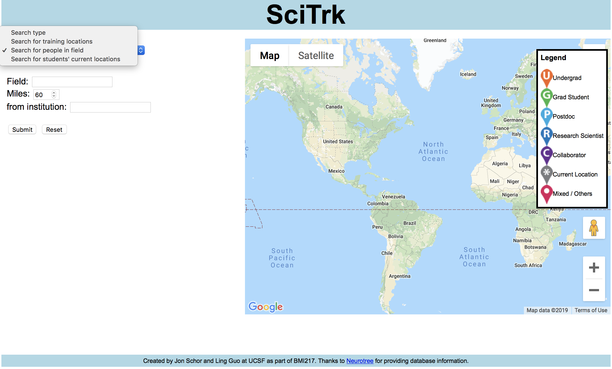

# SciTrk
Web app created for scientific software development class at UCSF

## Description
- Search for and visualize neuroscientists' scientific journeys on a map
- 3 search options:
  - Search for a neuroscientist's current and previous training locations and supervisors. 
  - Search for scientists in a certain field near an institute. (Good way to find collaborators nearby!)
  - Search for a neuroscientist's mentees' locations. 

## Contributors
Jointly developed and created by Ling Guo and Jon Schor. 

## Disclaimer
Some code/sections were omitted for security/privacy reasons. 
